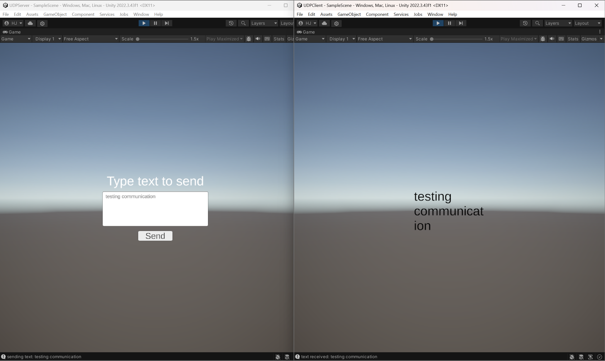

# UDP Communication between Two Unity Applications

**Name**: Hye-Young Jo  
**Email**: jhy.vfx@gmail.com

## How to Use
1. add UDPServer and UDPClient unity projects to your Unity Hub.
2. Open the UDPServer project's SampleScene, set your Wi-Fi IP in the OSC Sender script, and press play.
3. Open the UDPClient project's SampleScene and press play.
4. Type a message in the UDPServer to send it to the UDPClient.
* You can build the UDPClient project for mobile applications. Make sure both the server and client are connected to the same Wi-Fi, update the UDPServer's Wi-Fi IP to match the mobile device, and communicate between applications wirelessly.

## Credit
This project is a variation of the UnityOSC project (Open Sound Control interface for the Unity3D Game Engine, Copyright (c) 2012 Jorge Garcia Martin).
Full credit goes to Jorge Garcia Martin for the UDP communication implementation; I have adapted it for two different sides with a UI.